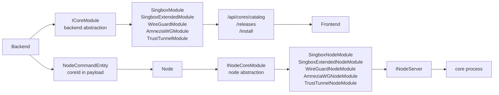

# Modules Architecture

> ## ⚠️ Current State (updated 2026-06-02) — authoritative, read before trusting the body
>
> The body predates Phase 1 + the Module Decoupling track (D1–D6). Where it conflicts, **this banner wins**.
> Canonical design: `../MODULE_SYSTEM_SPEC.md`.
>
> **Three neutral assemblies, not two.** Shared wire types live in `CitadelX.Modules.Abstractions`
> (referenced by both `*.Backend.Abstractions` and `*.Node.Abstractions`, so no Backend↔Node edge):
> `RuntimeKind`, polymorphic `ConfigArtifact` (`FileArtifact`/`OperationSet`/`CompositeArtifact`, flat
> `kind`-discriminated wire shape), `PlaceholderDirective`/`PlaceholderKind`, `NodeEnvironment`,
> `CompatibilityResult`, `NativeFormat`.
>
> **`ICoreModule` is much wider now** (all added **additively via default interface implementations**, so
> already-compiled plugins keep working): `RuntimeKind`, `ConfigContract Config` (SupportsStructured/Raw,
> NativeFormat, SupportsUsers, SupportsFlowEditor), `CompatibilityDescriptor Compatibility`,
> `InstallDescriptor Install` (`NoInstall`/`GitHubReleaseInstall`/`SystemPackageInstall`/
> `ContainerImageInstall` + `AssetMatchRules`), `ConfigArtifact? BuildConfig(ConfigInput, NodeContext)`,
> `IReadOnlyList<string> BuildSubscriptionLinks(SubscriptionRequest)`, typed
> `SubscriptionPayload BuildSubscription(SubscriptionRequest)`, `string? IconKey`. `ConfigContract` also
> carries optional `EditorLanguage` for UI editors when `NativeFormat` is not specific enough. The old
> `LaunchProfile`/`Repo`/`SupportsAutoInstall`/`SupportsSimpleSetup` still exist for now.
>
> **`INodeServer` changed:** `Reconfigure(string)` was **removed** and replaced by
> `Task Apply(ConfigArtifact artifact)`. Process cores accept only `FileArtifact`.
> Epic A/B added observability hooks: `ReadLogsAsync(ServerLogQuery)`, `GetRuntimeState()`, and
> `GetUserRuntimeSnapshots()`.
> Runtime state now includes `ServerRuntimeHealth` and `StatusMessage`. Current sing-box node modules
> implement logs through capped JSONL stdout/stderr logs and mark failed non-zero process exits.
> Per-user snapshots are optional; modules that cannot report user telemetry should return an empty list
> or explicit `Unavailable` snapshots rather than fake degraded status.
>
> **Pure-plugin loading (D2/D3) — no compile-time coupling.** Backend/Node `.csproj` and `Program.cs` have
> **no** ProjectReference or hardcoded DI for modules. Each of the 4 module projects has an MSBuild target
> `CopyToDropFolder` (`AfterTargets="Build"`) copying **only its own DLL** (`$(TargetPath)`) into the
> repo-root `Drop/modules/`. Shared contract DLLs are **not** copied (the plugin resolver returns null for
> them → type identity unifies against the host's already-loaded copy → casts succeed).
> **➜ Build modules with a full `dotnet build` (NOT `-t:Compile`), or the AfterTargets copy won't fire.**
> The shared Drop folder holds both backend-side and node-side DLLs; each loader silently skips the
> other side's DLL at Debug log level — harmless.
>
> **SingboxExtended is fully independent** (it's a fork): its own subscription builder
> (`SingboxExtendedSubscriptionBuilder`) and its own duplicated node engine
> (`SingboxExtendedNodeModule`, not reusing `SingboxNodeServer`). The two sing-box modules may diverge
> freely; matching link shape today is incidental. **Any subscription fix must be applied to BOTH builders.**
> Its backend module now also exposes a minimal guided setup (`mixed` inbound on `0.0.0.0:1080` with
> `direct` outbound) so pressing through the server wizard produces a runnable sing-box-style config instead
> of an empty raw `{ "inbounds": [] }` placeholder.
>
> **Installer is generic now (D4/P2).** `CoreInstaller` slug = generic normalization of `coreId`; the binary
> name flows from `module.Install` (`GitHubReleaseInstall.AssetRules.BinaryName`) through the
> `core.install` payload — no sing-box-specific switch. `SystemPackageInstall` also carries declarative
> package-manager repository hooks, post-install validation hooks, uninstall hooks, and a reboot-required flag.
> WireGuard and AmneziaWG use these hooks for tool/DKMS validation and package removal metadata.
>
> **Subscriptions (B4/R7):** both sing-box builders emit URI links when credentials are available:
> vless/vmess/trojan/shadowsocks/hysteria2/tuic plus Throne-compatible `socks5://`/`http://` links for
> `mixed`/`socks`/`http` inbounds. `mixed` emits both socks and HTTP links; unauthenticated proxy inbounds
> emit host/port-only URIs instead of being dropped. WireGuard returns a Throne-compatible `wg://` URI.
> AmneziaWG is now its own core id and always emits `enable_amnezia=true` in its `wg://` links, with
> Amnezia interface/query keys (`Jc/Jmin/Jmax/S*/H*/I*`) mirrored into full `.conf` subscription files.
> `ICoreModule.BuildSubscription` can return `UriList`, `ConfigFile`, or `Combined`; combined payloads are
> used when both base64 URI subscriptions and full client config output are available for the same user/server.
>
> **WireGuard Epic C is implemented for the first Linux target.** `WireGuardModule` and
> `WireGuardNodeModule` are plugin projects.
> The backend module declares `RuntimeKind.SystemService`, Linux/root/netadmin/tun/wireguard-kernel
> compatibility, a generic setup schema, a `FileArtifact` `wg0.conf` with node-local private-key placeholder,
> module-owned per-user key generation via `BuildUserTemplate`, and typed client `.conf` subscriptions. The
> node module writes configs, controls `wg-quick`, patches `[Peer]` blocks, reads logs, and reports health.
> It also reads `wg show <iface> dump` for live per-peer handshake/rx/tx telemetry and maps peers to users
> using `# CitadelX-UserId` markers in the config.
> Node placeholder resolution reports the derived server public key back through the command ACK, and Backend
> stores that non-secret value in the server artifact so subscriptions no longer require manual key entry
> after the first apply.
> The node module must prefer the `FileArtifact.FileName` (`wg0.conf`) over legacy `ServerLaunchProfile.ConfigPath`;
> `wg-quick` rejects arbitrary path basenames that are not valid interface names. The default server config omits
> server-side `DNS`, stores client DNS in a CitadelX metadata comment, and includes NAT/IP-forwarding `PostUp`/
> `PostDown` commands so a no-change wizard flow works on a fresh Debian-style host.
>
> **AmneziaWG exists as a separate WireGuard fork plugin pair.** `AmneziaWGModule` and
> `AmneziaWGNodeModule` intentionally do not reuse the WireGuard node server. The backend module declares
> `RuntimeKind.SystemService`, Linux/root/netadmin/tun compatibility, `SystemPackageInstall` binary
> `awg-quick` package `amneziawg`, manager-specific package names and pre-install repository steps for
> apt/dnf based systems, a guided setup schema with Amnezia obfuscation fields, and a
> `FileArtifact` default filename `awg0.conf`. The node module writes configs under `data/amneziawg`,
> controls `awg-quick up/down`, probes/telemeters with `awg show`, patches peers by `# CitadelX-UserId`,
> and uses the shared node-local `wireguard-private-key` generator because AmneziaWG keys are WireGuard
> X25519 keys. Guided setup and subscriptions are protocol-version gated: `1.0` emits `Jc/Jmin/Jmax`,
> `S1/S2`, and `H1-H4`; `1.5` adds `I1-I5`; `2.0` adds `S3/S4` and allows `H1-H4` ranges. The generated
> native config carries `# CitadelX-AmneziaWGProtocolVersion = ...` so full/file subscriptions and URI
> query values can omit unsupported fields for the selected protocol. On clean Debian/Ubuntu based nodes, the generic system-package installer runs the module's
> apt pre-install step to enable the Amnezia repository before installing `amneziawg`; on dnf based systems
> it enables the AmneziaWG COPR and installs the split `amneziawg-dkms`/`amneziawg-tools` packages.
>
> **TrustTunnel Epic D D1 exists as a Process core.** `TrustTunnelModule` and `TrustTunnelNodeModule` are
> plugin projects for AdGuard TrustTunnel Endpoint. The backend module uses `GitHubReleaseInstall` against
> `TrustTunnel/TrustTunnel`, binary `trusttunnel_endpoint`, asset prefix `trusttunnel`, and emits a bundled
> TOML `FileArtifact` containing `vpn.toml`, `hosts.toml`, `credentials.toml`, and `rules.toml`. The node
> module splits the bundle into files, starts `trusttunnel_endpoint vpn.toml hosts.toml`, captures logs,
> patches `credentials.toml` for user commands, and reports process runtime state. Guided setup now covers
> the official endpoint surface used by CitadelX: main TLS hosts, ping/speedtest paths, direct or SOCKS5
> forwarding, reverse proxy, optional ICMP, Prometheus metrics, and simple CIDR rules plus raw extra
> `rules.toml` snippets. Keep these settings in `TrustTunnelSimpleSetupSchema` and `TrustTunnelModule`
> rather than adding TrustTunnel-specific form branches in Frontend.

`Modules/` is the extension layer for CitadelX cores. A core is a runtime such as sing-box or sing-box-extended. Each supported core can have a backend module and a node module.

## Conceptual Split



The backend side explains what a core is. The node side knows how to run it.

## Backend Abstractions

Location:

```text
Modules/CitadelX.Backend.Abstractions/
```

Main contract:

```csharp
ICoreModule
```

Fields (most added additively via default interface implementations, so already-compiled plugins keep working):

- `Id` - stable core id used by Backend, Frontend, Node, and persisted state.
- `Label` / `Description` / `Ready` / `Aliases` / `IconKey`.
- `RuntimeKind` - `Process` / `SystemService` / `RemoteClient` / ...
- `Config` (`ConfigContract`) - SupportsStructured/Raw, NativeFormat, SupportsUsers, SupportsFlowEditor.
- `Compatibility` (`CompatibilityDescriptor`) - OS/arch/feature constraints, matched against `NodeEnvironment`.
- `Install` (`InstallDescriptor`) - `NoInstall` / `GitHubReleaseInstall` / `SystemPackageInstall` / `ContainerImageInstall` (+ `AssetMatchRules`, manager-specific package names, and optional pre-install shell steps for repository setup).
- `BuildConfig(ConfigInput, NodeContext)` - returns the polymorphic `ConfigArtifact`.
- `BuildSubscription(SubscriptionRequest)` - typed per-module subscription payload (`UriList`, `ConfigFile`, or `Combined`).
- `BuildSubscriptionLinks(SubscriptionRequest)` - legacy URI-list hook kept for compatibility.
- Legacy (still present during Phase 1): `SupportsAutoInstall`, `SupportsSimpleSetup`, `SimpleSetupSchema`, `LaunchProfile`, `Repo`, `NodeModuleAssemblyName`.

Supporting classes:

- `ConfigContract`, `ConfigInput`, `NodeContext`, `CompatibilityDescriptor`, `InstallDescriptor`, `SubscriptionRequest`
- `CoreConfigSchema`, `CoreLaunchProfile`
- `CoreRepoOptions` - keyed `Resolve(coreId)` lookup; names no core. Each module carries its own default repo.

Backend consumes these through:

- `CoreModuleRegistry`;
- `CoresController.GetCatalog`;
- `CoresController.GetReleases`;
- `CoresController.Install`;
- `CoresController.DownloadNodeModule`.

## Node Abstractions

Location:

```text
Modules/CitadelX.Node.Abstractions/
```

Contracts:

- `IServer` - start/stop/restart and `Apply(ConfigArtifact)` (the old `Reconfigure(string)` was removed).
- `IManagedServer` - user lifecycle operations.
- `INodeServer` - combines process and user operations and accepts launch profiles.
- `INodeCoreModule` - factory for `INodeServer`.

Models:

- `UserEntity` - node-side user representation.
- `ServerLaunchProfile` - local launch metadata.

Utility:

- `AtomicFileWriter` - atomic local file writes.

Node consumes these through (there are **no** built-in DI registrations — modules load as plugins only):

- `NodeModuleRegistry` (loads plugin DLLs from `NodeConnection:ModulesPath`, i.e. the shared `Drop/modules/`);
- `NodeModuleManager`;
- `NodeCommandDispatcher`;
- `ServerRegistry`.

## Current Backend Modules

### SingboxModule

Path:

```text
Modules/SingboxModule/
```

Core metadata:

- `Id`: `Singbox`
- `Label`: `Singbox`
- aliases: `sing-box`, `singbox`
- auto-install: supported
- simple setup: supported
- launch arguments: `-c "{configPath}"`
- `UseRunCommand`: true
- repo: `CoreRepos:Singbox`
- node module DLL: `CitadelX.SingboxNodeModule.dll`

Note: `SimpleSetupSchema` now returns `SingboxSimpleSetupSchema.Schema` (schema + UI + defaults). The Frontend renders it generically via `SchemaForm.vue` — there is no sing-box-specific form in Frontend anymore. The guided setup no longer uses presets that override user choices: `inboundType`, `inboundSecurity`, and transport are independent inputs. The default guided path is intentionally compact: `VLESS + Reality`, listen `0.0.0.0:443`, direct outbound, and advanced socket/outbound/routing/transport sections hidden behind `advancedMode`. `Security=None` must produce a config without `tls`/`reality`. `SingboxConfigBuilder` generates Reality server `private_key` and `short_id` when omitted, keeps client-only Reality `public_key` and inbound `utls` out of the server config, and avoids creating partial VLESS/VMess/Trojan users without required credentials. `SingboxSubscriptionBuilder` derives the VLESS subscription `pbk` from the persisted private key and emits a client URI fingerprint default. The module also implements `BuildConfig` (structured → `SingboxConfigBuilder`, raw → passthrough), `BuildSubscriptionLinks`, and typed `BuildSubscription` (`SingboxSubscriptionBuilder`).

### SingboxExtendedModule

Path:

```text
Modules/SingboxExtendedModule/
```

Core metadata:

- `Id`: `SingboxExtended`
- `Label`: `Singbox Extended`
- aliases: `sing-box-extended`, `singbox-extended`
- auto-install: supported
- simple setup: false
- launch arguments: `-c "{configPath}"`
- `UseRunCommand`: true
- repo: `CoreRepos:SingboxExtended`
- node module DLL: `CitadelX.SingboxExtendedNodeModule.dll`

### WireGuardModule

Path:

```text
Modules/WireGuardModule/
```

Core metadata:

- `Id`: `WireGuard`
- aliases: `wireguard`, `wg`, `wg-quick`
- runtime: `SystemService`
- install: `SystemPackageInstall`, binary `wg-quick`, Linux package `wireguard-tools`
- config: INI `FileArtifact` named from the interface (`wg0.conf` by default)
- subscriptions: combined Throne-compatible `wg://` URI plus full/downloadable client `.conf`

### AmneziaWGModule

Path:

```text
Modules/AmneziaWGModule/
```

Core metadata:

- `Id`: `AmneziaWG`
- aliases: `amneziawg`, `amnezia-wg`, `amnezia`, `awg`, `awg-quick`
- runtime: `SystemService`
- install: `SystemPackageInstall`, binary `awg-quick`, Linux package `amneziawg`, apt/dnf repository pre-install steps
- config: INI `FileArtifact` named from the interface (`awg0.conf` by default)
- guided setup: WireGuard-style interface settings plus Amnezia obfuscation fields (`Jc/Jmin/Jmax/S*/H*/I*`)
- subscriptions: combined `wg://` URI with `enable_amnezia=true` plus full/downloadable client `.conf`

AmneziaWG is intentionally not exposed as a WireGuard mode. It is a separate core id so catalog, availability,
install status, server profiles, and subscriptions can diverge from kernel WireGuard cleanly.

## Current Node Modules

### SingboxNodeModule

Path:

```text
Modules/SingboxNodeModule/
```

`SingboxNodeModule` implements `INodeCoreModule`:

- `CoreId`: `Singbox`
- aliases: `sing-box`, `singbox`
- creates `SingboxNodeServer`.

`SingboxNodeServer` implements `INodeServer`:

- starts/stops/restarts through `SingboxProcessManager`;
- `Apply(ConfigArtifact)` accepts a `FileArtifact`, normalizes its content, and writes it atomically;
- patches users through `SingboxConfigPatcher`;
- writes config atomically through `AtomicFileWriter`;
- stores disabled user JSON through `DisabledUserStore`.

`SingboxProcessManager`:

- owns the process object;
- applies `ServerLaunchProfile`;
- builds command arguments;
- inserts `run` when `UseRunCommand` is true and args do not already start with `run`;
- redirects stdout/stderr;
- kills the process tree on stop timeout.

`SingboxConfigPatcher`:

- loads JSON from string or path;
- finds an inbound by tag, then type, then any inbound with `users`;
- adds/edits/removes users;
- syncs users against an allowed list;
- serializes formatted JSON.

User key resolution:

| Inbound type | User key |
| --- | --- |
| `mixed` | `username` |
| `socks` | `username` |
| `http` | `username` |
| other types | `name` |

### SingboxExtendedNodeModule

Path:

```text
Modules/SingboxExtendedNodeModule/
```

`SingboxExtendedNodeModule` implements `INodeCoreModule`:

- `CoreId`: `SingboxExtended`
- aliases: `singbox-extended`, `sing-box-extended`
- creates its **own** server (the engine — process manager / config patcher / disabled-user store / node
  server — is duplicated into this module's namespace).

SingboxExtended is treated as a fully independent fork: it shares no code with `SingboxNodeModule`, so the two
may diverge freely. Any behavioral fix must be applied to both copies if it should apply to both.

### WireGuardNodeModule

Path:

```text
Modules/WireGuardNodeModule/
```

`WireGuardNodeModule` implements Linux `wg-quick` control for `WireGuard`: it writes `FileArtifact` configs,
starts/stops with `wg-quick up/down`, probes and reads telemetry through `wg show`, and patches `[Peer]`
blocks by `# CitadelX-UserId`.

### AmneziaWGNodeModule

Path:

```text
Modules/AmneziaWGNodeModule/
```

`AmneziaWGNodeModule` is the Amnezia fork runtime: it stores configs under `data/amneziawg`, starts/stops with
`awg-quick up/down`, probes and reads telemetry through `awg show`, and patches peers with the same
`# CitadelX-UserId` convention. It uses the same node-local `wireguard-private-key` generator for server
private/public keys because AmneziaWG uses WireGuard-compatible X25519 keys.

## Backend + Node Module Binding

The binding is convention plus metadata:

1. Backend module exposes `Id`.
2. Backend queues commands with `coreId` or persists `ServerEntity.Type`.
3. Node receives a command with that `coreId`.
4. Node resolves an `INodeCoreModule` by `CoreId` or aliases.
5. Node creates or reuses an `INodeServer`.

The backend module can also expose `NodeModuleAssemblyName`. If a node does not have the module built in or already loaded from `ModulesPath`, `NodeModuleManager` can download a DLL through:

```text
GET /api/cores/modules/{coreId}/node
```

Backend serves the DLL from the package zip named:

```text
<CoreModules:PackagePath>/<module.Id>.zip
```

The zip must contain the DLL named by `NodeModuleAssemblyName`.

## Backend + Frontend Module Binding

Frontend calls:

```text
GET /api/cores/catalog
```

Each `CoreModuleDto` comes from `ICoreModule` and includes:

- id;
- label;
- description;
- ready flag;
- auto-install flag;
- simple setup flag;
- optional schema/defaults;
- launch profile defaults.

Frontend uses this for:

- server creation core cards;
- auto-install availability;
- release/install UI;
- default selected core.

Guided setup is schema-driven (Step 7, done): a module exposes `SimpleSetupSchema` (schema + UI hints + defaults) and the Frontend renders it generically via `SchemaForm.vue`. There is no sing-box-specific form or `buildSingboxConfig()` in Frontend anymore. A new core gets a guided form for free by providing `SimpleSetupSchema`; otherwise raw JSON mode still works generically. UI behaviour is capability-driven (`runtimeKind`/`supportsRaw`/`supportsFlowEditor`), not by core id.

## Adding A New Core

1. Create a backend module project that references `CitadelX.Backend.Abstractions` (which transitively brings `CitadelX.Modules.Abstractions`). **Do not** add a ProjectReference from Backend to it.
2. Implement `ICoreModule`: pick a stable `Id` + aliases + `IconKey`; declare `RuntimeKind`, `Config` (`ConfigContract`), `Compatibility`, `Install`; implement `BuildConfig` and, if the core has client subscriptions, typed `BuildSubscription` (legacy `BuildSubscriptionLinks` is still accepted for URI-list-only modules).
3. Create a node module project that references `CitadelX.Node.Abstractions`. Implement `INodeCoreModule` and an `INodeServer` whose `Apply(ConfigArtifact)` materializes the config and whose lifecycle starts/stops the runtime.
4. Add the `CopyToDropFolder` MSBuild target (`AfterTargets="Build"`) to both csproj so each DLL lands in repo-root `Drop/modules/`. **No DI registration anywhere** — the plugin loaders pick them up.
5. The Node installer is generic (D4): the binary name flows from `Install` metadata; no code change needed for a new GitHub-release core. System-package installs can declare package-manager-specific package names and pre-install shell steps for repository setup; container installs are declared but not yet executed by Node.
6. Frontend is schema-driven: provide `SimpleSetupSchema` for a guided form, or rely on raw mode. Avoid core-specific Frontend code; use catalog capability fields + `CoreIcon`.

## Packaging

For **local development**, modules are not packaged: each module project's `CopyToDropFolder` MSBuild target
(`AfterTargets="Build"`) copies its own DLL into the repo-root `Drop/modules/`, which both the Backend and Node
plugin loaders read. Build with a full `dotnet build` of the module project (not `-t:Compile`) so the target
fires. Shared contract DLLs are intentionally **not** copied (type identity unifies against the host's loaded copy).

The zip packaging below is for **distributing node-side module DLLs to remote nodes** (served via
`GET /api/cores/modules/{coreId}/node`), not for local loading.

`tools/build-modules.ps1` builds backend and node module projects and creates:

```text
Modules/tools/Singbox.zip
Modules/tools/SingboxExtended.zip
Modules/tools/WireGuard.zip
Modules/tools/AmneziaWG.zip
Modules/tools/TrustTunnel.zip
```

Each package includes:

- backend module DLL;
- node module DLL.

When the expected backend folder exists, the script copies:

- package zip to backend `modules/packages`;
- backend module DLL to backend `modules`.

The script prefers this workspace's `Backend` folder and falls back to the old `CitadelX.Backend` folder name.

## Versioning And Compatibility

Keep these stable unless intentionally migrating:

- `ICoreModule.Id`;
- `INodeCoreModule.CoreId`;
- command type strings;
- command payload property names;
- `ServerLaunchProfile` persisted shape;
- user template JSON semantics.

If a module changes config patching semantics, verify:

- create server;
- add user;
- disable/enable user;
- remove user;
- sync users;
- restart / `Apply(ConfigArtifact)` process.

Before changing contracts or module behavior, also check:

- persisted `ServerEntity.Type` and `ServerLaunchProfile.CoreId` still resolve through the registries;
- existing node profiles still start;
- Frontend catalog cards still render from `/api/cores/catalog`;
- core install still selects the correct asset for the node's OS/arch (`/api/cores/availability`);
- user add/remove still patches the intended inbound;
- Node still ACKs command success/failure with clear error text.
